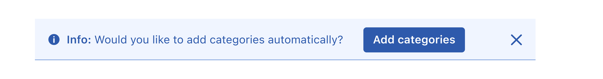
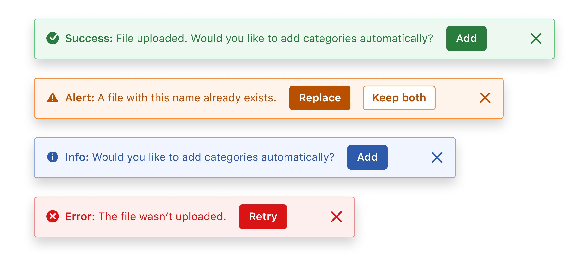

### Usage

-   Four different colors are available to define alert status.
-   The status icon and the keyword that defines the message type for the alert must be semi-bold.
-   Alerts can have multiple text lines.
-   Alerts can contain links. These links are defined in primary color.
-   Toast and stripe alerts can be temporary. The delay times for these temporary alerts to disappear are shown below:
    -   10 sec if there are actions associated.
    -   5 sec if there are no actions associated.
    -   In both cases, the time freezes on hover to allow the user more time to interact with the alert message. On mouse out, the countdown continues.

### Types

| Type        | Usage                                                                                                                                                               |
| ----------- | ------------------------------------------------------------------------------------------------------------------------------------------------------------------- |
| Error       | The error alert is Red. It indicates that something went wrong after performing an action. (E.g.: The form couldn’t be saved because some data was missing)         |
| Success     | The success alert is Green. It appears when the action is successful. (E.g.: The user was created successfully).                                                    |
| Warning     | The warning alert is Yellow. It lets users know that the action was completed, but there are some issues with it. (E.g. The item was created but with some issues). |
| Information | The information alert is Blue. It provides relevant information while a user carries out a task.                                                                    |

See the [colors page](../../foundations/color) to learn more about color definitions.

### Attributes

An alert has 4 different attributes:

1. The status icon
2. The type text
3. The description text
4. The close button. This may not appear, depending on the alert's use.

The image below shows the metrics for an alert's design:

### Variations

#### Feedback indicator

Feedback indicator is the minimum expression of an alert to capture the user's attention. As an indicator, you can use a status icon to easily identify the warning message with the element.

Feedback indicators can be used in scenarios such as forms or sidebars  to capture the user's attention in specific places without the need of displaying a more prominent notification.

An example is shown below:

If the meaning of the icon is not explicit with text, a tooltip should be shown when the user hovers over the status icon.

#### Toast

As a notification, it is a reminder that does not interrupt the user's operation.

#### Toast stacking behavior

Several toast notifications can be shown at the same time. They appear temporarily at the bottom of the screen and stack vertically with 16px margin in between. If the alert is temporary, it will disappear in 5 seconds.
 

##### Showing

The latest messages appear at the bottom of the notifications block. 
Every Toast appears from a 16px bottom to top  transition and fade in 250ms ease in out following showing/hiding principles.  
 

##### Hiding / Closing

After a 5000ms delay every notification disappears with an 200ms ease in fade out  transition.

In case there is any item above the deleted notification, it transitions to fill the space of the deleted item 200ms ease in.

 

 

Toasts can have actions associated. Actions are always represented by buttons while navigation is represented by links:

 

This type of alert must appear at the bottom left side of the screen. There must be a 24px separation from the left and from the bottom. 

An example is shown below:

#### Embedded

Embedded alerts are meant for use in forms. Usually you will only need to use the information one. Its width depends on the width of the container it is placed in, always respecting the container margins to the content. The close action is not required for embedded alerts.

An example is shown below:

#### Stripe

Stripe alerts can be an alternative solution for embedded and toast alerts because they save vertical space. They are usually placed closer to form sections and headers.

A modal window with an information stripe alert:

#### Inline

An inline action doesn’t start a new line as a block action and only takes as much width as necessary. It’s placed hereafter of the alert message. 

An inline action can be used on any Alert variant: Toast, Embedded, or Stripe.

Using inline actions can cause different alert widths. Therefore, Product Designers need to set a maximum width to keep consistency and avoid overflow problems across their products.  

We recommend using inline actions for messages of two lines maximum, otherwise use block actions. 

