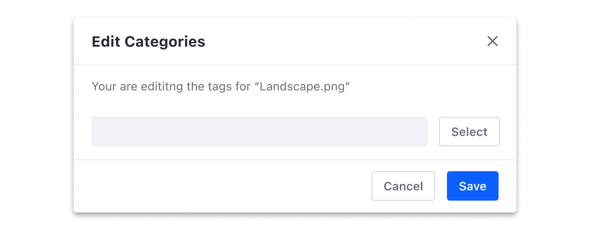
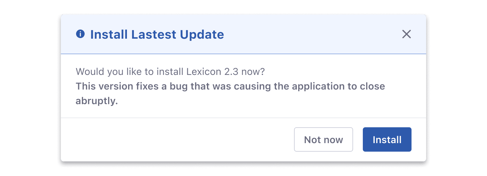
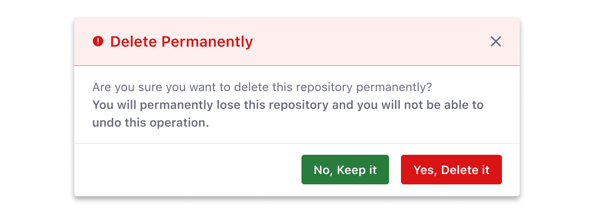
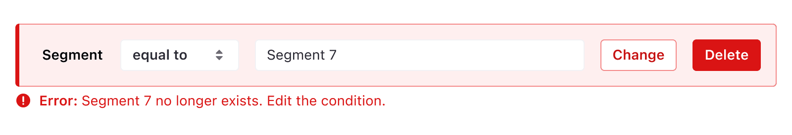

### Types
An action-based color button is a primary button that uses alert colors to help people identify certain actions more easily. There are 4 types of action-based color buttons:

#### Success
Indicates a positive action, such as the addition of an item.

#### Info
Usually informs the user about a neutral event.

#### Warning
Indicates an action that can have some side effects and users should be cautious. These actions can be undone by the user if the action was made mistakenly. 

#### Error
Indicates a dangerous action, generally a destructive action. These actions cannot be undone.

### States

#### Default State

#### Hover State

#### Active State

#### Disabled State

### Usage
Action-based color buttons are used to draw attention and give extra meaning to important actions. They are used when we need to emphasize the meaning of a call to action button but they should be used with moderation.

#### Modals
We recommend using the primary color for modals, instead of action-based color buttons.

However, action-based color buttons can be used in modals for status messages to accentuate the action and its meaning. But for the sake of consistency and coherency, we recommend always using the same kind of buttons. That is to say, choose between primary color or action-based color buttons in modals for status messages and stick to that.

As with any other primary call-to-action button, do not place two action-based color buttons together as this can force the user to spend time making sense of the color-label association.

Don't

 

Do

 
 

In a context where an action-based color button is next to a secondary button, you can choose to style the latter, using a secondary button as shown in the previous image or a secondary action-based color button as shown in the following image.

### Alerts
Action-based color buttons can also be used in alerts when there is a need to highlight the action inside the alert. But you should take into account that it needs to be the only primary action in a specific context, to help the user identify the main action.
