import { Grid, Box } from 'theme-ui'

### Types

#### Primary

The primary button is always used for the most important actions. Two primary actions can't be near each other.

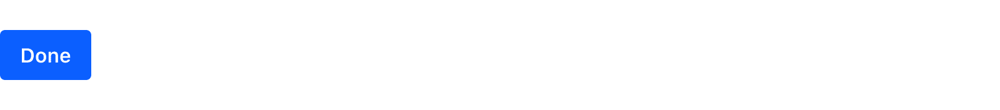

#### Secondary

The secondary button is always use for secondary actions. Several secondary actions can be near by each other.

#### Link

The link button is mainly used for Cancel actions.

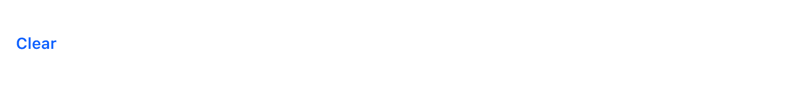

#### Action

The [action-based color button](./action-buttons) is a primary button that uses alert colors to help people identify certain actions more easily.

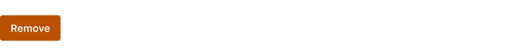

### States

#### Default state

#### Hover state

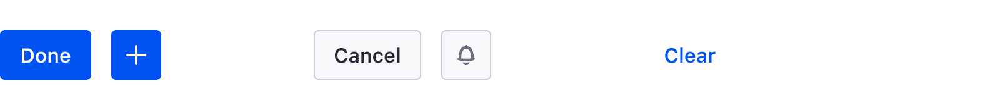

#### Active state

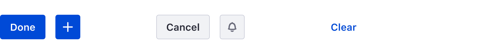

#### Disable state

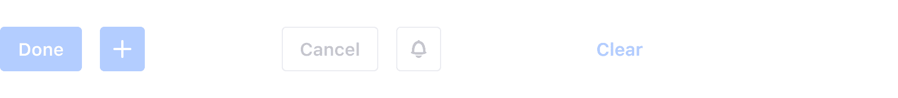

### Sizes

#### Default

The default size is a height of 40px. It is used for main page actions such as Save or Cancel.

#### Small

The small size is a height of 32px. It is used for actions inside a page, such as dropdowns, button groups, and split buttons.

### Dos and Don'ts

 

1. Use the same height for all the buttons that are in the same row.

<Grid variant='smallCards' >
	<Box>
		

			
		

		
Do

	</Box>
	<Box>
		

			
		

		
Don't

	</Box>
</Grid>

 
 
 

2. Characters can not all be uppercase in a button.

<Grid variant='smallCards' >
	<Box>
		

			
		

		
Do

	</Box>
	<Box>
		

			
		

		
Don't

	</Box>
</Grid>

 
 
 

3. Text can not wrap multiple lines. It must all be on one line.

<Grid variant='smallCards' >
	<Box>
		

			
		

		
Do

	</Box>
	<Box>
		

			
		

		
Don't

	</Box>
</Grid>

 
 
 

4. A borderless button must be placed either before or after a set of bordered buttons.

<Grid variant='smallCards' >
	<Box>
		

			
		

		
Do

	</Box>
	<Box>
		

			
		

		
Don't

	</Box>
</Grid>

 

### Variations

#### Secondary borderless

A secondary borderless button is used in toolbars when a secondary button would be too heavy for the toolbar's design. This keeps the design clean.

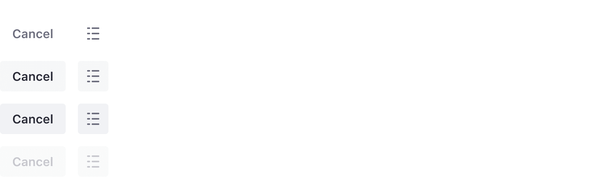

#### Icon button

Buttons can display icons instead of text. The icons, however, must be monospaced inside the button. Icon buttons are used primarily in [management bars](./toolbars/management-bar). This button variation can be primary, secondary, or borderless type.

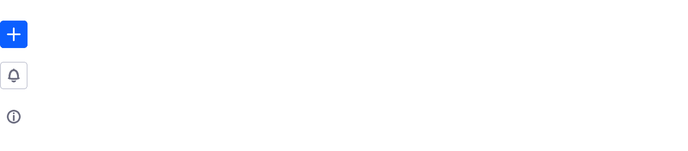

#### Icon and text button

This button type is only used in sites, outside of administration. The icon emphasizes and helps communicate the action. The label must match the icon's purpose.

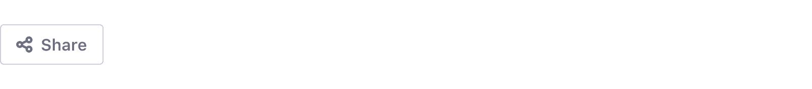

#### Block level button

Buttons can also be configured at block level. Use this configuration when you need to communicate that an important action is required for the user. For example, it can be used as a load more action below a list. Please do not use it in forms. Choose the button type carefully. Primary is not always the best choice, nor is it the only configuration.

#### Dropdown button

Dropdown buttons are always used with a dropdown menu. This button variation can be secondary or borderless type.

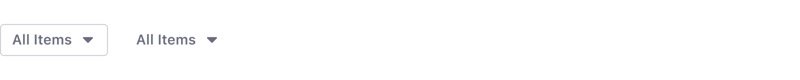  

#### Split button

Split buttons are used when you need to offer the user a quick main action along with secondary actions.

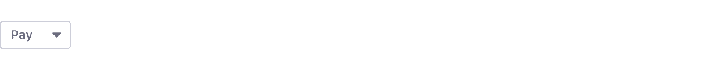

#### Button group

Button groups are used to switch between complementary views for example, but they must never be used for complementary actions, "Change and Cancel" actions, or "Save and Cancel" actions. In those cases, single buttons are the correct solution.

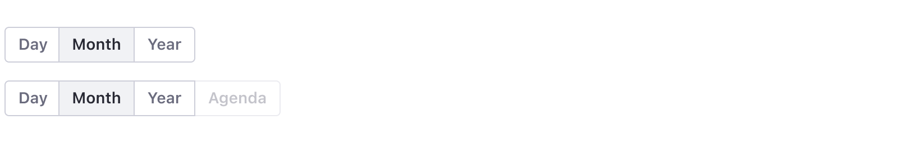

#### Plus button

Plus buttons provide add actions for a dataset and are normally placed in toolbars. The add button lets you add entities, such as a blog post for a blog, a message board thread for a message board, or a folder. It can have one action or multiple. Visit Dropdown menu > Sorting actions to learn more.

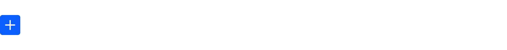

#### Action button

Action buttons are used when a set of contextual actions are needed for an element or a dataset. This button displays a set of actions inside a dropdown menu. The actions must be sorted in a specific way. please visit Dropdown menu > Sorting actions to learn more.

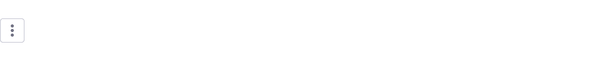

