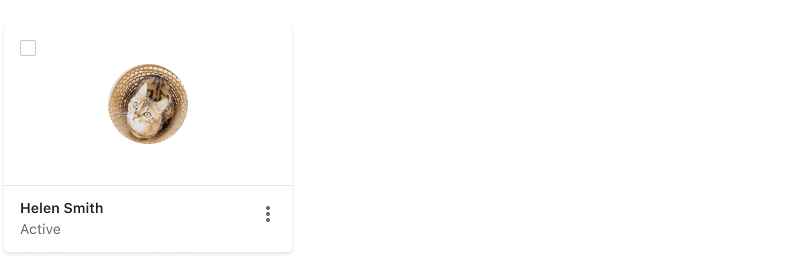
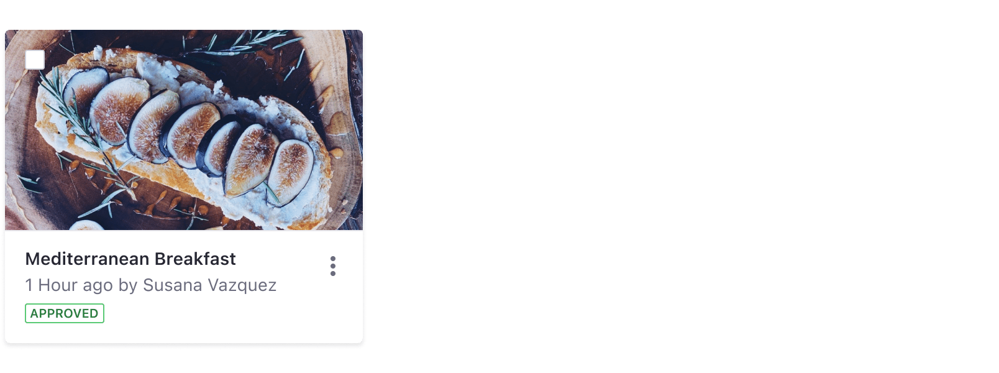
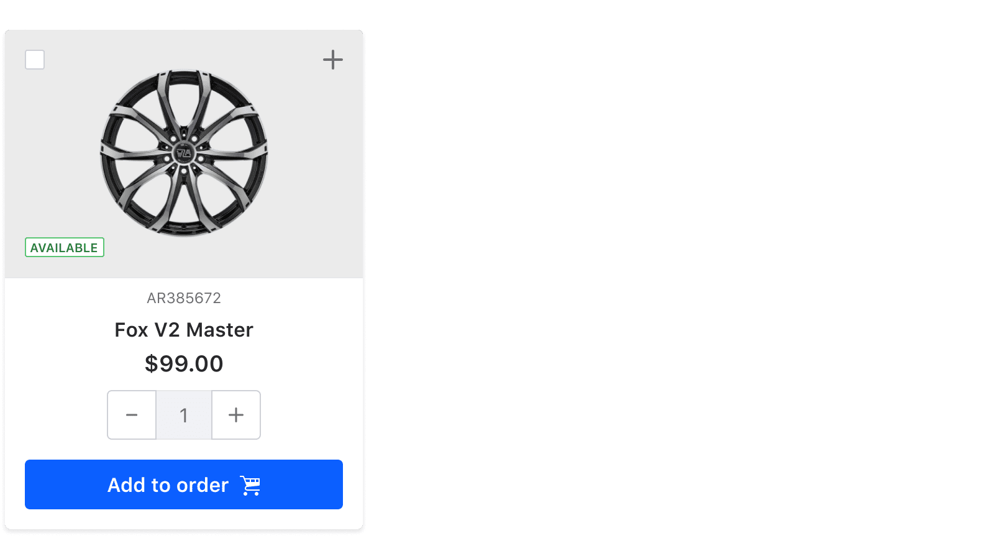
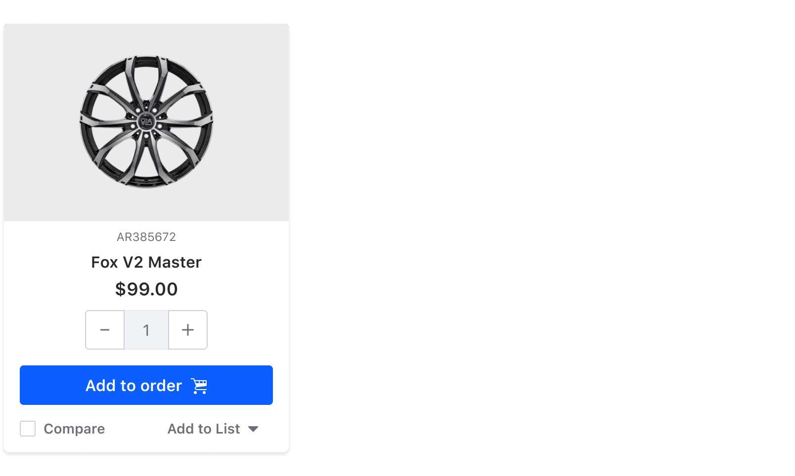

## Image card

Image cards are used in image/document galleries.

### Image with different ratios

Images can vary in size. So no visual information is lost in the card, Lexicon maintains the original images aspect ratio within the image area's container.

Aspect ratio might be used when the content to represent in the card is a document. The image can expand to fill the area.

## User card

User cards represent users. The user is represented by its profile image or a default user icon.

## File card

File cards represent files other than images.

## Folder card

Folder cards display horizontal representations of information. They have the same amount of elements as the other cards previously explained on this page. The main purpose of this card is to represent folders, therefore the image is removed in this card type. In this case, only the checkbox is used to select.

## Blog card

Blog cards uses images keeping the vertical aspect ratio, wrapping all the area, giving a visual clue to identify blog entries.

 

## Product card

Product cards use a different arrangement of elements, using transparent images on colored backgrounds.

 

Product cards encourage users to add the item to the shopping cart using a button as a prominent call to action. Users can also compare with other items or add them to a wish list.

 
