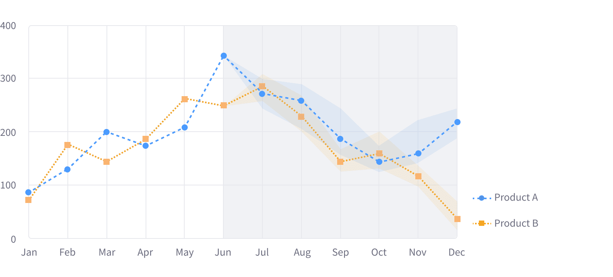
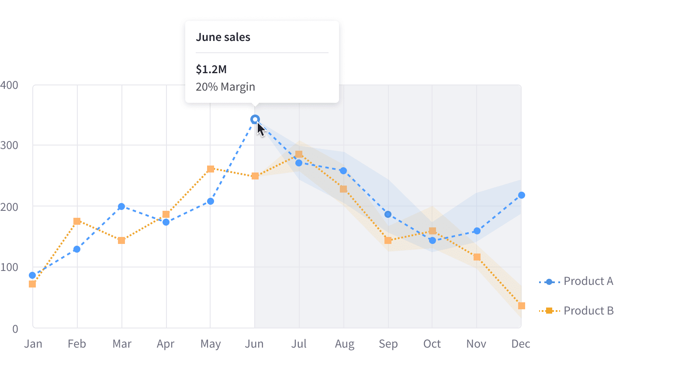
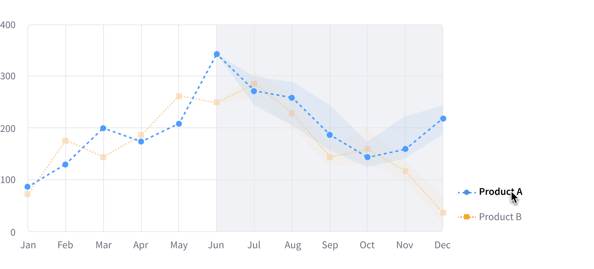

 
 

This chart contains three key parts: the past, the present, and the future. The past is represented with a line that goes up to the present. The present, or current date, is the point where the line starts having a shaded background. Finally, the future, or prediction, is differentiated with a shaded background.

### States

#### Single point interaction

#### Legend item interaction

