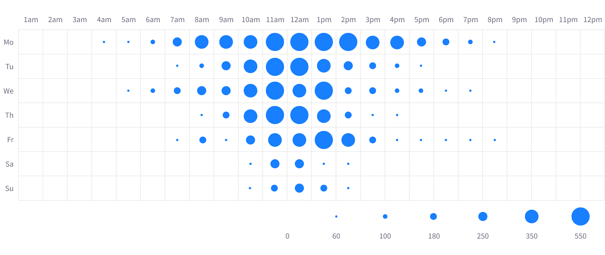
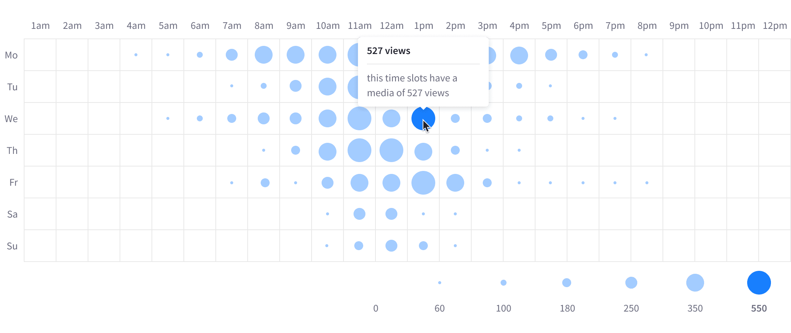
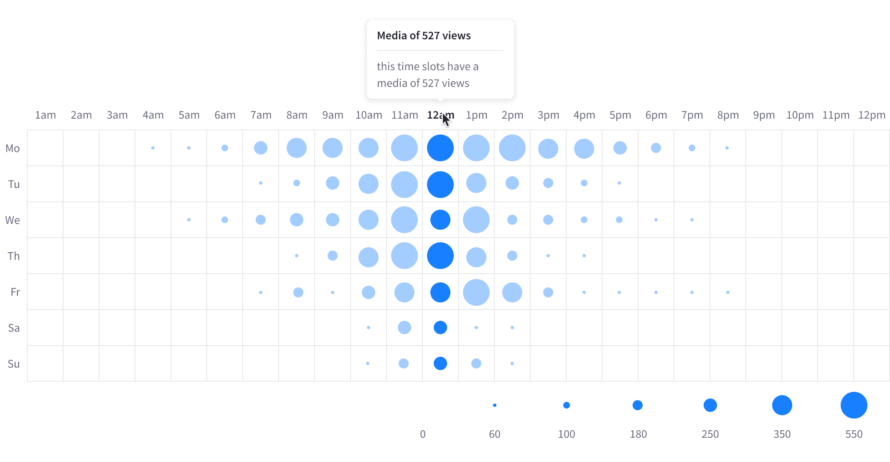
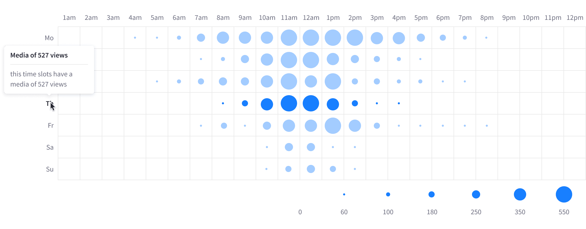
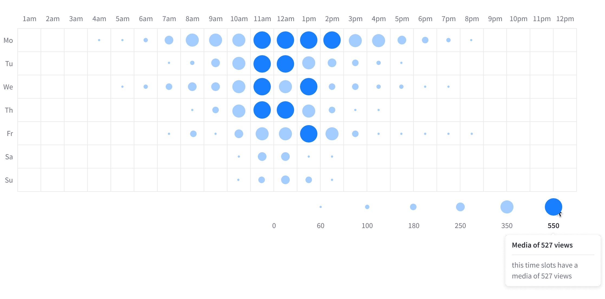

### Color use

Lexicon currently provides a series of color sets for the Experience Cloud analytics design. For the heatmap, you must use a **single color value** and white for the time-spots.

### Shapes use

To improve the activities readability, you can use up to seven different circle items (bubbles) inside the chart: 0, 4, 8, 12, 16, 24, 32.

### States

#### Single item interaction

#### X-axis item interaction

#### Y-axis item interaction

#### Legend item interaction

