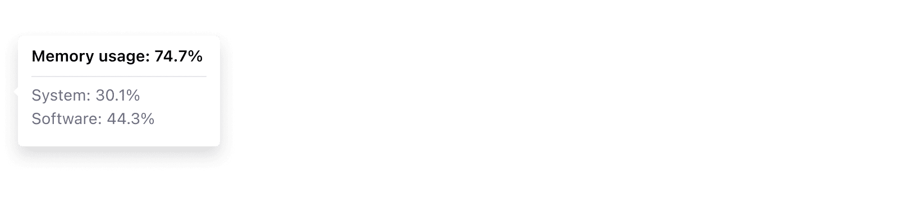
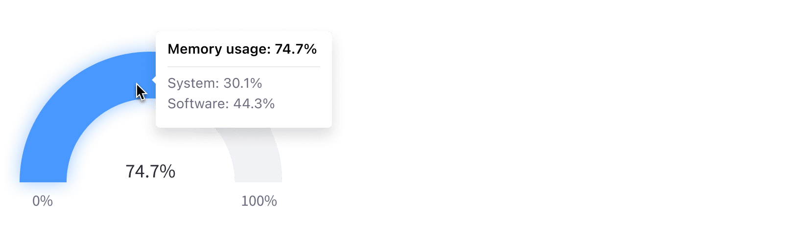

### Interaction events

If you need to create your own chart, it's useful to know how our events are defined. Use the rules covered in this section to keep a consistent user experience with the rest of the charts.

#### Mouse events

**Mouse hover**

-   Show popover

**Mouse out**

-   Dismiss popover

**Mouse click**

-   If an element is not selected, the following behaviors are expected:
    -   Selects the element. Grays out the remaining elements with a 40% opacity.
    -   Show popover
-   If an element is selected, the following behaviors are expected (the click can be in the element itself or any other part of the chart, except the popover):
    -   Unselects the element
    -   Dismisses the popover
    -   Resets the chart to its default state

#### Touch events

Same as mouse click events.

### Interaction items

#### Chart item

This can be a bar inside a Bar Chart, a pie slice in a Pie Chart, etc.
The popover must show information related to this specific item.
The popover must be shown on top of the chart item.
Highlight the legend item (font weight to semi-bold). This clearly communicates the relationship between the chart element and its corresponding legend value.

#### Chart item inside a group

We don't differentiate between grouped items and stand alone items. When a user interacts with an item in a set of items, the behavior is the same as a Chart Item.

#### Axis item

The popover must show information related to all the elements in that axis row or column. This information can either be global information, like a number, or an information breakdown.
The popover must be shown next to the axis item without hovering the chart.

Sometimes there will only be one axis. Sometimes the chart will not provide interaction on both axis. This is perfectly normal.

_Example: Vertical stacked bar_

-   An interaction in the x-axis item will show a popover with information for each of the items.
-   An interaction in the y-axis item will show nothing.

#### Legend item

Highlight all items of this legend type in the chart.
The popover must show information related to this specific item summary for that legend type.
The popover must be shown on top of the legend item.

### Chart popover

A chart popover lets you display specific data for an exact point or an exact area that is interactive. This is another usage of the popover pattern.

The following half donut chart shows a chart tooltip in action:

