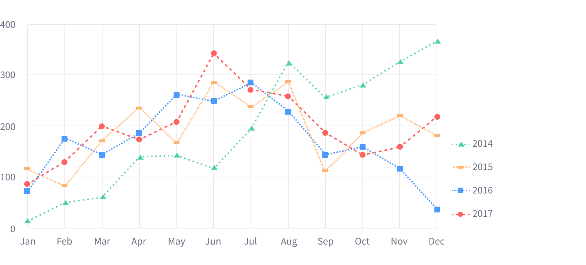

 
 

The points in a Line Chart are spaced apart (typically by their x-axis value) and joined with straight line segments. A Line Chart is often used to visualize a trend in data over intervals of time – a time series – thus the line is often drawn chronologically.

Line Charts can also be used to compare changes over the same period of time for more than one group.

### Color use

Follow the standard color order rules to determine color order for Line Charts. Each graph will have a different color with different line types and shapes, so you can easily differentiate each of them.

### Pattern use

You can use either [Pattern](./../) (line type or shape type) for Line Charts to help improve accessibility for your users. It's up to you to decide when best to use them.

### States

#### Chart item interaction

#### Legend item interaction

