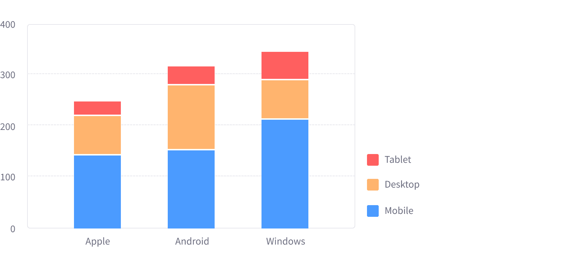
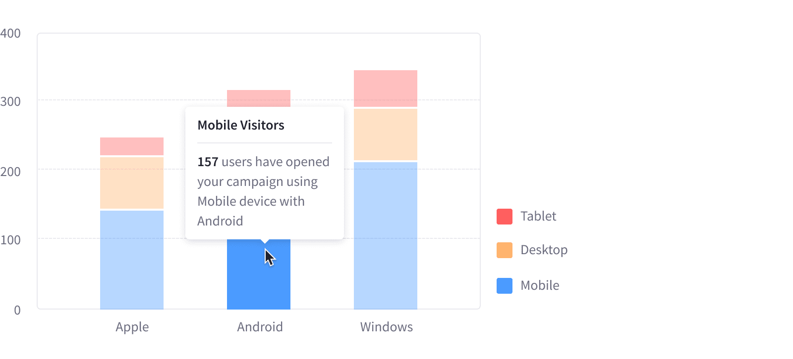
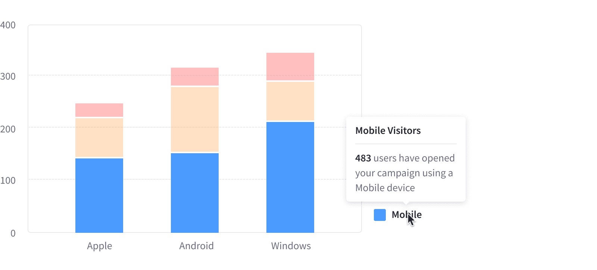
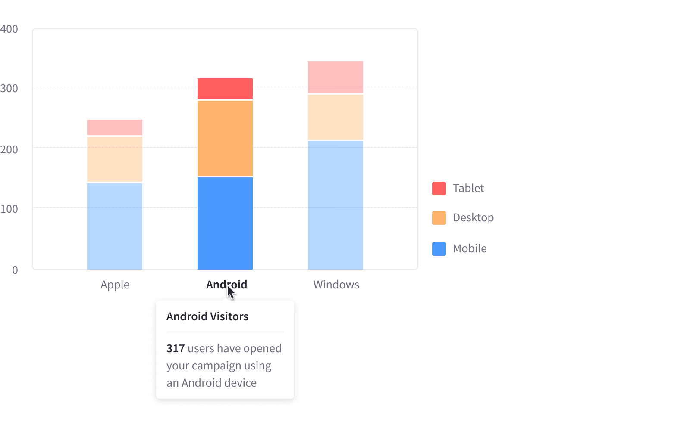

Stacked Bar Charts can either be displayed in vertical bars or horizontal bars. This page focuses on vertical bars, but horizontal bars are also acceptable.

This chart type is implemented using Bar Charts.

### Color use

The Stacked Bar Chart follows the same color order defined for charts. They must start from left to right in horizontal bars and from bottom to top in vertical bars.

### States

#### Single bar item interaction

#### Legend item interaction

#### Axis legend interaction

