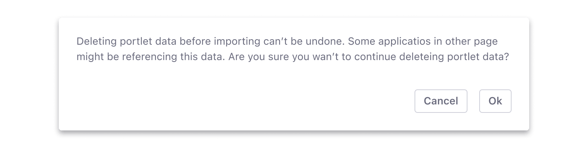

### Usage

#### When to use it

Confirmation messages should be used when the user's action will result in a critical situation. There are two main use cases to consider:

-   A risk action: The action the user is going to perform has significant consequences that can't be undone or easily undone. Ex: site deletion.
-   An unintended consequence: The action the user is taking has notable side effects that may leave them feeling disoriented. Ex: a site switch that results in a complete change of context, including user permissions.

Confirmation messages are rarely needed and should only be used when they fall under one of the two cases mentioned above.

#### When must not use it

Providing extremely clear feedback can prevent the need for confirmation messages. Do not use a confirmation message for the following cases:

-   Error prevention: The interface should clearly communicate its intended use, thus preventing the need for a confirmation message to communicate potential errors.
-   Undo actions: If an action has an undo action, you must never use a confirmation message to proceed with the action. A clear example is “Move to Recycle Bin”.
-   Unless a confirmation message is absolutely required, as explained in the previous section, do not use one.

#### How to write a confirmation message

Your confirmation message must clearly communicate the situation and the potential results of proceeding with the action. An unclear message can result in the user mistakenly taking irreversible actions or finding themselves in an unexpected situation.

Follow these guidelines to write a good confirmation message:

-   Do not write generic and open questions. Ex: Are you sure?
-   Be clear and concise.
-   Provide exact information to your user, so there is no uncertainty on the action to be confirmed.
-   Address your questions and statements so they can be easily answered with "Ok" and "Cancel", as they are provided by the browser.

### Implementation

Confirmation messages are browser native. Therefore, Lexicon does not style them. Browser native confirmation messages are accessible and work perfectly on every device.
