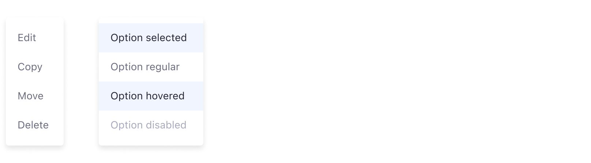
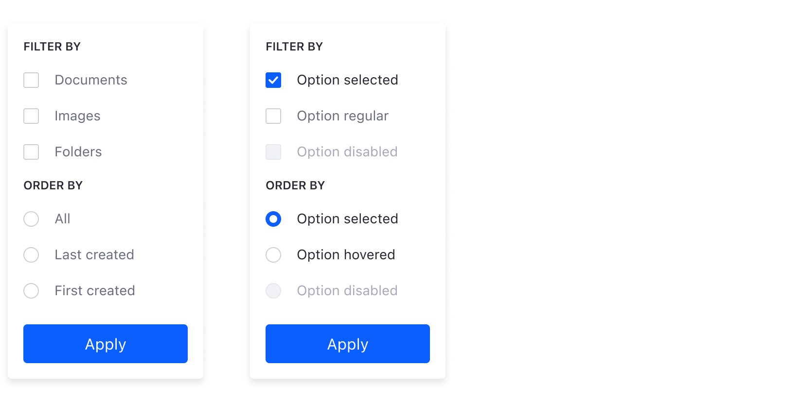
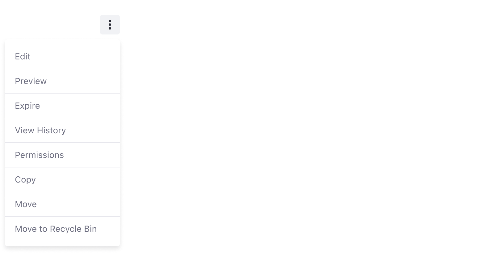
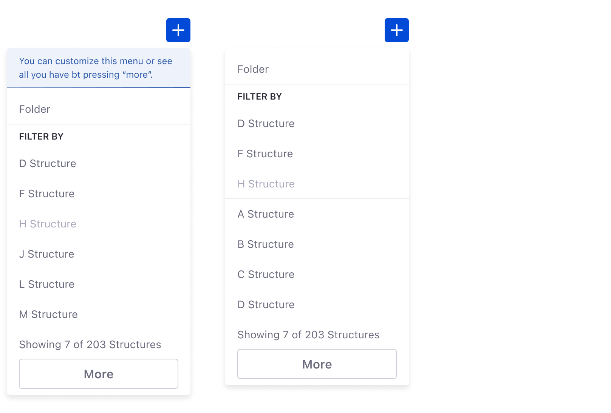

### Usage

Dropdowns display a list of options that are not easy to manage on the screen. This mechanism organizes these options into a condensed menu, keeping the screen clean and making their intention more implicit.

Dropdowns are usually triggered from a dropdown button or a button with an icon. These are the two most common implementations in Lexicon.

To close a dropdown, use one of the following methods:

-   Select an option in the panel, if they are mutually exclusive.
-   Click on the button that triggered it.
-   Click outside the panel.

Dropdowns have a maximum width of 240px. When an option's text doesn't fit into the available space, use two lines. The text for each option should be short and specific enough to be able to fit on one line if possible.

The maximum height is 500px for desktop and 400px on mobile devices. Vertical scroll is allowed when the content exceeds the limit.

The distance between the trigger button and the dropdown must be 8px.

### Types

#### Default

The default dropdown is a panel that doesn't support scrolling for the content inside it. Use the default configuration when you have a small number of options or when the panel is big enough to contain all the elements you want to use.

#### Dropdown with dividers

Use a dropdown menu with dividers to keeps actions organized in an actions menu. Organizing the actions by context of use makes it easier for users to find them.

#### Dropdown with checkbox or radio

Dropdowns can be configured to have checkboxes and/or radio groups. You can use checkboxes to filter dataset elements, while a radio can be useful for ordering the criteria in a dataset.

#### Dropdown with search field

Action menus can sometimes contain multiple elements, making it a little time consuming to scroll through the entire list of options. In these cases, you can add a search field to your dropdown menu so your users can quickly find the action and move on to their next task.

#### Dropdown with icons on the left

Dropdown menus with icons on the left are suitable for process bars (wizards), when the number of steps do not fit the screen. This configuration can display the remaining steps.

This configuration is also suitable to help quickly identify an actions menu item with an icon that closely relates to it.

#### Dropdown with icons on the right

Dropdown menus with icons on the right are suitable for process bars (wizards) when the number of steps do not fit the screen. It displays the remaining steps and emphasizes the step number by placing the icon on the right side.

#### Dropdown with groups

This dropdown menu variation is for use with the management bar Filter and Order dropdown button. This configuration is used to refine the management bar UI options, providing the user with more specific mechanisms to find data.

Buttons in dropdown groups can either be primary or secondary, depending on the application needs.

### Sorting actions

#### Dropdown menu from actions button

Below is a list of guidelines for creating actions menus. Note that not all of these guidelines are always required:

1. Order by context (use a separator line between each of the groups):
    - Primary commands: edit, preview, open, etc.
    - Secondary commands specific to the object: expire, view history, etc.
    - Transfer commands: copy, duplicate, move, export, import, etc.
    - Object settings: permissions, configuration, etc.
    - Object commands: delete, move to the recycle bin, etc.
2. General rules
    - Group size must be less than or equal to seven.
    - The total number of elements must not exceed 15 items.
    - Use separator lines between groups.
    - Do not increase the menu complexity with submenus.
3. Groups must be ordered by frequency of use. For items inside a group, use alphabetical order.
4. Disabling actions:
    - If an action is not available for an item due to its state, disable it.
    - Only remove an action if the item by nature can't perform the action.
5. Use icons to help identify actions.
6. Complementary actions must work together (Ex: Lock, Unlock)
    - When one is available, the complementary action must be disabled.
    - In some cases both actions may be available at the same time (Ex: undo / redo)
7. Only present the actions that make sense in the context. Do not overload the menu. This doesn't mean to remove disabled items.

#### Dropdown menu from Plus button

Plus button's can contain multiple actions. When this is the case, these actions are displayed in a dropdown menu.

Users can customize a list of favorites in the plus button's dropdown menu, as shown in the message in the image on the left. This is available via a modal window that is triggered by the _More_ button at the bottom. An example configuration is shown in the image on the right.

_Note: The default behaviour of the More button is to load more items in the dropdown menu, but it is not the desired one._

Favorites are ordered using the following rules:

Out of the favorites the order is ruled as follows:

-   The first two elements are the most used ones.
-   The remaining favorites are displayed in alphabetical order

Dropdown menus for plus buttons can also contain scrollbars to view a long list of items, as shown in the image below.

When creating dropdown menus for plus buttons, please follow the guidelines shown below:

1. The menu must be split into two main areas:
    - Primary actions: always contains the generic actions. Example: folder.
    - Secondary actions: contains actions that fit a certain category. Example: structures, document types, etc.
2. Secondary organization:
    - The first group should contain favorites if they exist.
    - The second group should contain the remaining actions.
    - Display a maximum of seven actions between favorites and not favorites.
    - Display a message that shows the total number of actions inside the category. Example: “Showing 7 of 203 items”
    - Include a More area to give access to the modal that contains the rest of the items and lets the user customize the list of favorites.
3. Sorting inside each group:
    - Place the most used item first.
    - Place the remaining items in alphabetical order.
4. The dropdown menu can't exceed 15 actions.
