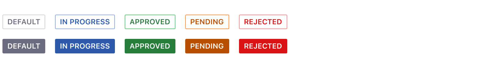
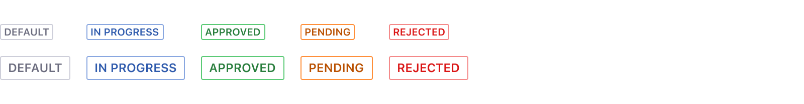
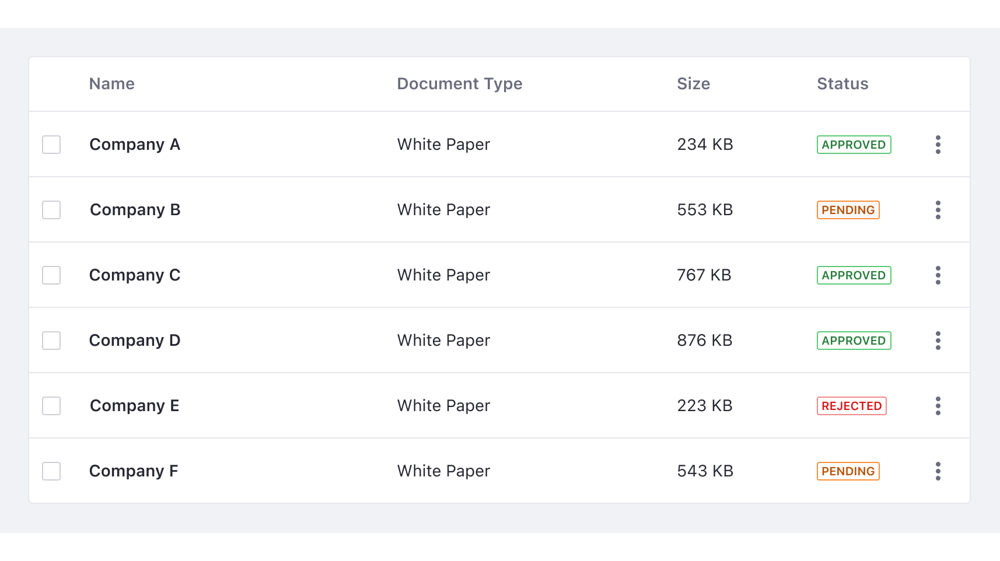
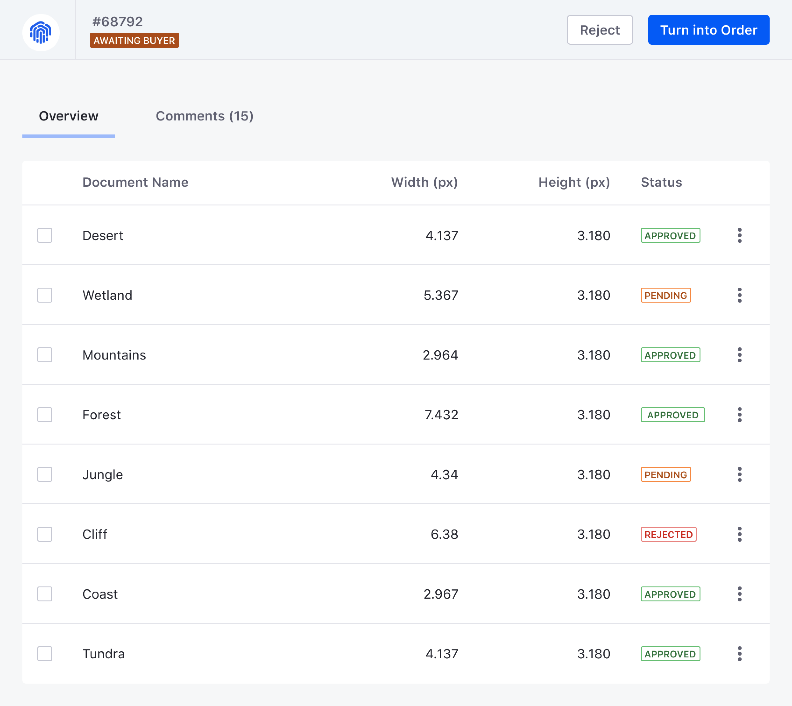
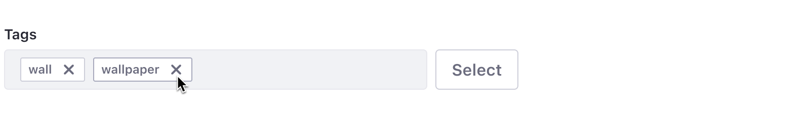

import { Grid, Box } from 'theme-ui'

### Overview

Labels can be applied in a wide range of cases as a mechanism to tag content, show status, filter content or even provide navigation to elements of the same identification.

### Simple labels
Use simple labels to identify or filter content, tag content, show status or even to provide navigation to elements.

Simple labels can use status colors to highlight the status of an element to provide quick recognition. Simple status labels use colors to indicate meaning and they can be bold or outline. The colors are chosen intentionally so that users can recognize them easily.

#### Outline status labels

Use outline status labels by default and in places where there are many status labels on the same screen such as in tables, lists...etc.

In the following image, you can see different status labels in a table. In this example, outline status labels are used as they dominate the screen.
 

#### Bold status labels

Bold status labels are used in an infrequent manner to draw attention to important information. For example, in headers when you need to differentiate a label from the rest of the labels in a list. Do not use bold labels as default or alongside many other status labels. Background color and text in bold status labels have a **minimum contrast ratio of 5:1** for each color.

In the image below, you can see different status labels in a table and a status label in the header section. In this example, a bold status label is used in the header to differentiate it from other labels.
 

### Removable label

Use the removable label in filter bars, categories, etc. A removable label should always be the default size and have no status color. It contains a close icon to remove the label.

#### Removable label with sticker

This label is a variation from label removable, which can only be used with a default size. You can use this label with icons or round stickers.

The label must never be longer than the available space. However, there are cases in which removable labels need to be placed in a second line or as a last option it will be truncated.

### Label with link

You can use labels to link related content to a site.

### Sizes

#### Small

Use the small label when the label doesn’t need emphasis. Always use uppercase text for the small label. Small labels are usually used in tables, list and cards.  |

 

#### Default

Use the default size to mark states. The use of lowercase is acceptable for this size. We recommend using the default label outside of tables like for example in headers.

### Dos and Don'ts

1. Labels categorize information and provide quick recognition. They do not contain badges.

<Grid variant='smallCards' >
	<Box>
		

			
		

		
Do

	</Box>
	<Box>
		

		
		

		
Don't

	</Box>
</Grid>
 
 

2. Labels can only contain one line of text.

<Grid variant='smallCards' >
	<Box>
		

			
		

		
Do

	</Box>
	<Box>
		

			
			

		
Don't

	</Box>
</Grid>
 
 

3. Never use Ellipsis on labels.

<Grid variant='smallCards' >
	<Box>
		

			
		

		
Do

	</Box>
	<Box>
		

			
		

		
Don't

	</Box>
</Grid>
 
 

4. Keep your text short, up to 1 or 2 words.

<Grid variant='smallCards' >
	<Box>
		

			
		

		
Do

	</Box>
	<Box>
		

			
		

		
Don't

	</Box>
</Grid>
 
 

5. Don’t use bold status labels alongside many other status labels.

<Grid variant='smallCards' >
	<Box>
		

			
		

		
Do

	</Box>
	<Box>
		

			
		

		
Don't

	</Box>
</Grid>
 
 

6. Use color labels for status only.

<Grid variant='smallCards' >
	<Box>
		

			
		

		
Do

	</Box>
	<Box>
		

			
		

		
Avoid

	</Box>
</Grid>