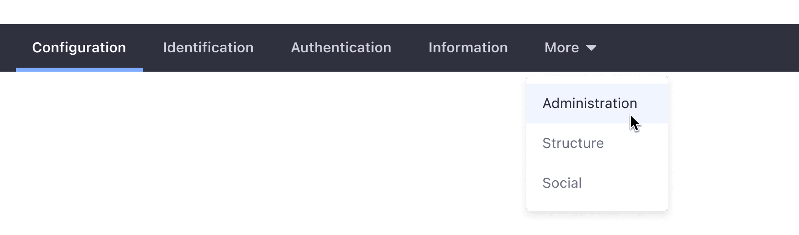
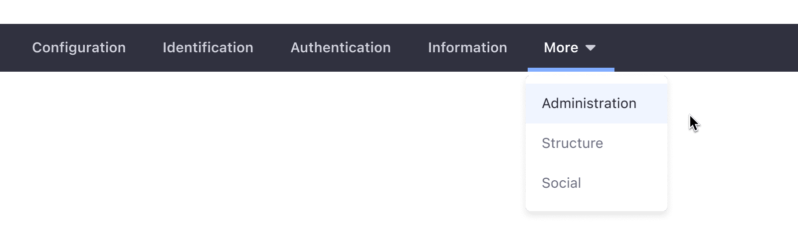

### Usage

Navbars are used inside applications to provide navigation to the different sections of the application.

A navbar is always horizontal and can contain one or several entry points, placed from left to right. Place the most important entry points first.

When the number of tabs exceeds the navbar's size, the overflowing tabs are collapsed into the last one. The collapsed tabs are accessible through a dropdown menu. Please see the following example:

-   The user uses the dropdown menu from the last tab to select an entry.

-   The user has selected an option from the dropdown menu.

-   When the user opens the dropdown menu, the first option appears marked as selected.

-   Once a tab is selected outside the dropdown menu, the dropdown menu collapses.

### Variations

#### Default

The positive navigation bar is defined for Sites. It displays navigation items in a light background with dark text.

#### Inverted

The negative navigation bar is defined for Admin controls. It displays navigation items in a dark background with light text. It is always placed right below the header.

