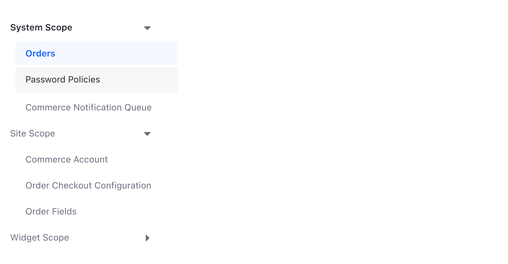
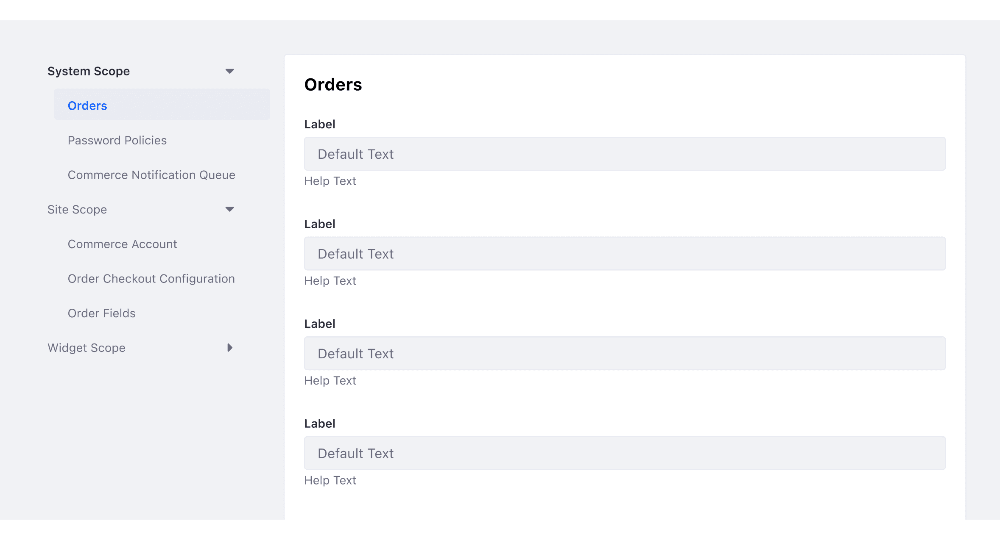
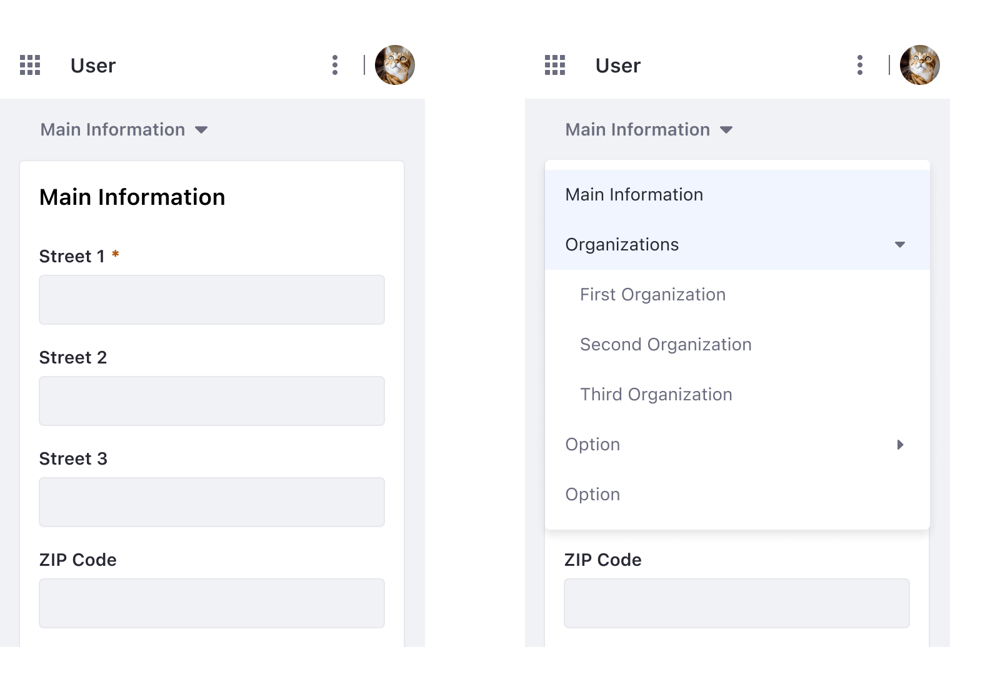

### Usage

This pattern is always vertical and placed on the left side of the form. It provides navigation between different pages/forms. Commonly, this navigation pattern is used in lower navigation levels to reach the lowest level pages.

Vertical Navigation is commonly used in form templates. We recommend that you split long forms into smaller forms to make the task easier. 

### States

#### Default state

#### Hover state

#### Active state

#### Selected state

### Mobile

On mobile devices, the navigation transforms into a full-width collapsible menu that's displayed right before the form. This menu is always displayed over the form when it's opened, so it never pushes down the content.

