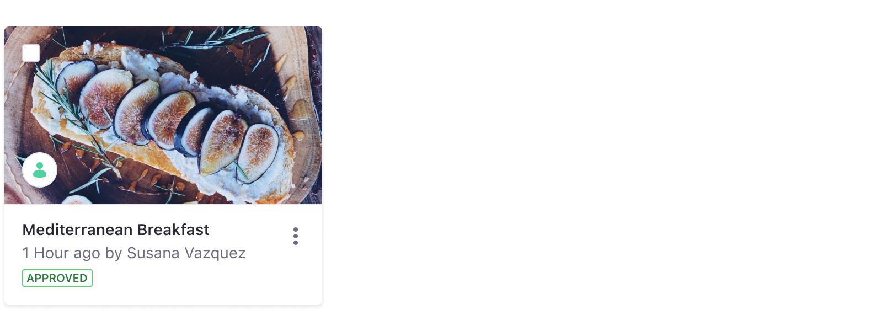

### Usage

Use stickers to visually identify elements in a dataset that are part of the same group. Stickers can be any color.

### Sizes

#### 24px

Use the 24px size sticker in smaller context when you only require visual identification for the element and don't need the user to interact with it.

#### 32px

Use the 32px size sticker in image cards, so you can see more parts of the image.

#### 40px

Use the 40px size sticker to identify the user in a comment in the comments portlet in sites. This size is only rounded.

#### 48px

Use the 48px size sticker to identify the user in a blog entry or article in sites. This size is only rounded.

### Colors

Stickers can be any color, and the default color for stickers is #6B6C7E, which corresponds to Main Lighten 28% desat 5%.

For Documents and Media please follow the following specification of colors and icons.

### Variations

#### Square

Use a square sticker to identify files and folders. You can place up to three characters or an icon inside it. Always use uppercase letters.

#### Round

Only use the circle sticker to identify people. You can places up to two characters or an image inside it. Always use uppercase letters.

### Position

You can place a sticker of any type in an Card. Its position is always bottom left, as shown in the example below:

