### Usage
The most known example of a tree view is a folder structure for file systems but it can be used for showing any hierarchical relationships.

The tree view provides a way to display information in a hierarchical structure by using collapsible items (nodes). You can navigate between these items using either your mouse device or your keyboard.  

### Parts
A tree view consists of two general elements:

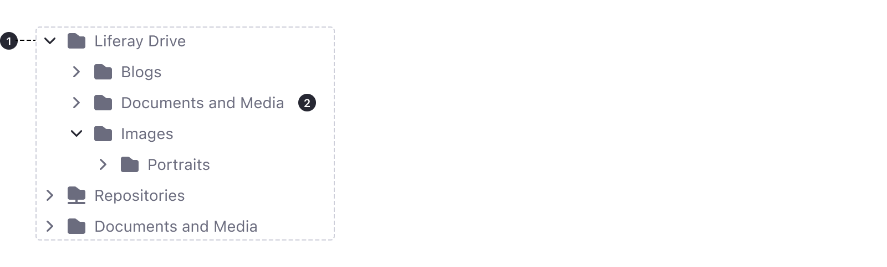

1. Tree View box
2. Nodes

#### Tree View Box

A tree view box is a container that has a defined width and height constraining the nodes within. 

#### Node

A tree view node has the following parts:

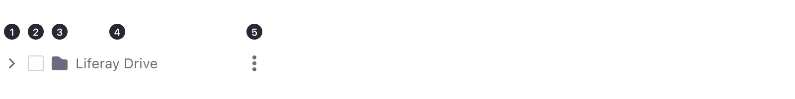

The elements within these areas are left-right stacked on the left stack and right-left stacked on the right stack. 

1. **Expander** (left stack). Used to expand or collapse the nodes. 
2. **Check Box** (left stack). They are displayed in front of the node’s text or the icon stack. The nodes support "tri-state" checkboxes.
3. **Icon/s** (left stack). Item icons are displayed in front of the nodes text (after check boxes, if they are shown). We recommend using one icon before the text for the item typologies and one or more icons after the text for item states or indicators.
4. **Text** (left stack) 
5. **More actions** (right stack)

#### Type of Nodes

**Root Node.**
Node that doesn’t have a parent node. Commonly the first node of the tree but not necessary.
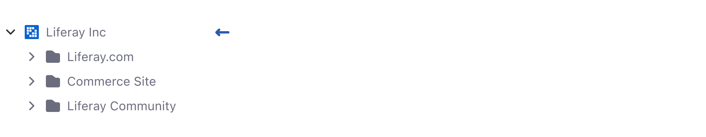       

**Child Node.**
Node that has a parent; any node that is not a root node is a child node.
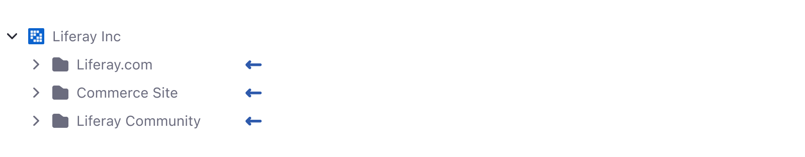      

**End Node.**
Node that does not have any child nodes; an end node may be either a root node or a child node.
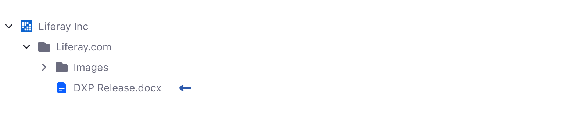      

**Parent Node.**
Node with one or more child nodes. It can be expanded (open) or collapsed (close).
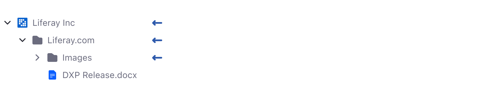      

**Expanded Node.**
Parent node that is expanded so its child nodes are visible.
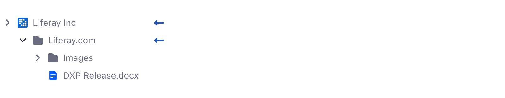      

**Collapsed Node.**
Parent node that is collapsed so the child nodes are not visible.
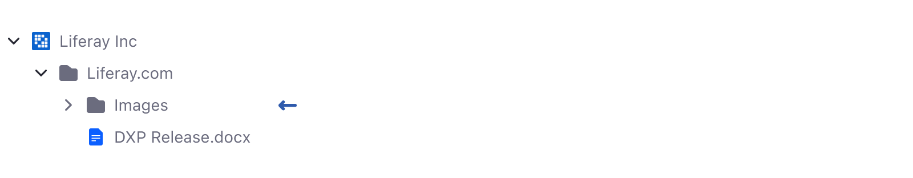      

These nodes show different color variations when they are setting their states in dark or light scheme.

### Selection

The nodes should provide an interaction event to be selected. By default, a node is selected clicking the area of the node container and changes to its visual state: selected.

#### Expanded on Selection

Item icons are displayed in front of the nodes text (after check boxes, if they are shown). We recommend using one icon before the text for the item typologies and one or more icons after the text for item states or indicators.

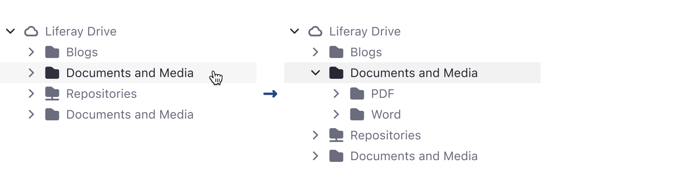      

#### Multi Selection

If multiselection is enabled, the nodes will show checkboxes and multiple checkboxes can be checked. For selections that affect hierarchically use tri-state behavior instead.

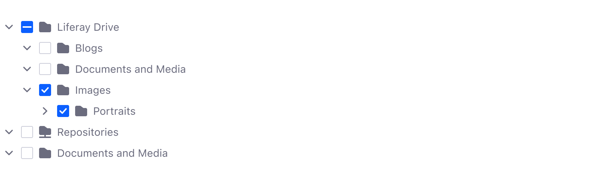      

-   If a parent node is checked, then all the child nodes’ states will also be checked.
-   If one of the child nodes is not in a checked state, then the parent node will be in an intermediate state.
-   If all the child nodes are in checked state, then the parent node’s state will also be checked.

#### Hover Action

Hovering a node can trigger the visibility of elements within it. Frequently is used to show actions related to the node such as “more actions”, “remove”, etc.

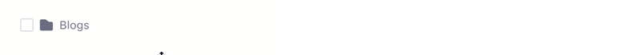     

If the node is already selected, actions could be shown directly or revealed on hover.

### Variants

The tree view component can be modified to create several variants. This is a result of modifying the density parameters and the various elements that set up the nodes. Some of them are displayed below.

#### Sticker

This variation shows a representation of a hierarchy using user stickers:

     

#### Text Size

This variation shows a section hierarchy of a page customizing some node properties. This way, the Vertical Navigation component can be recreated using Tree View. 

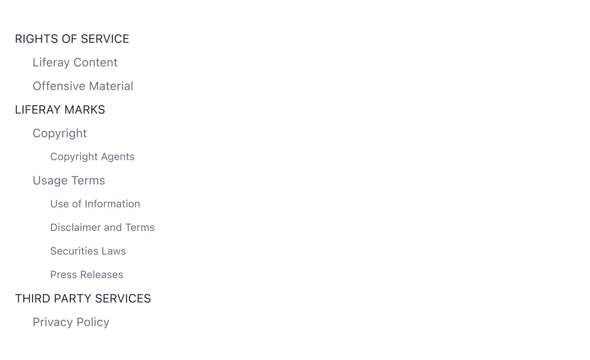     

#### Toggle Button

This variation shows a hierarchy of items that can be selected directly using buttons. A known example in Liferay products is the Vocabulary tree view within the Category selector in DXP:

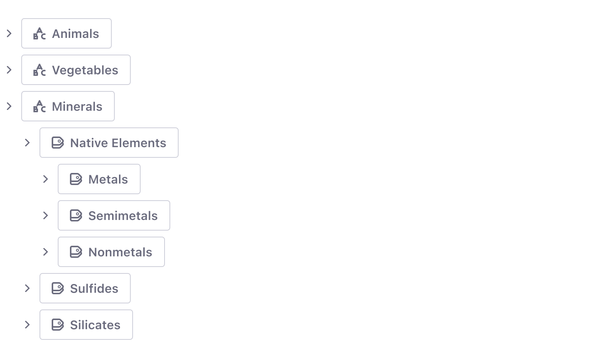     

### Focus Management

All possible actions that can be taken via mouse must be able to do via keyboard.

As a general rule, once the focus enters the Tree View area, the first node item receives focus. Then if the user presses:   

-   **Tab key,** the focus moves to the next focusable component.
-   **Shift + Tab.** the focus moves to the previous focusable component.
-   **↑ ↓** moves the focus up/down respectively.
-   Disabled nodes do not receive the focus.

For other keys, see the Shortcuts section shown in the documentation.