Lexicon's layout framework aims to provide a common structural reference to ease the component creation and page composition processes, as well as to provide a visual consistency between the different elements of the interface.

### Base Grid

The Base Grid is the main metric reference of our system from which the rest of the layout structures are built. It defines the starting point of the dimensions, as well as the paddings and margins of the elements of the interface.

The grid is constructed from a base 8px module, so that both the dimensions of the elements and the distances between them will always be multiples of 8: 16, 24, 32, 40, 48 …

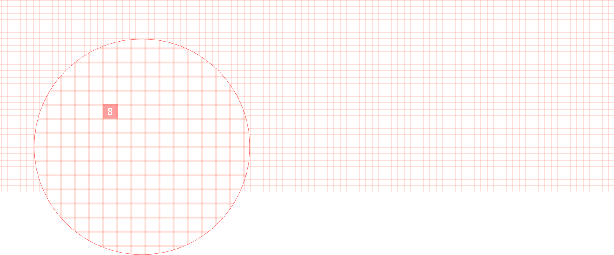

 

This provides a common metric pattern that creates a visual coherence and consistency between the different elements of the system and their spatial relationships.

This grid favors an efficient workflow, reducing the number of design decisions, as well as creating a shared visual language between designers and developers.

Specifying a metric unit of 8px helps maintain visual consistency and lets you take advantage of its other benefits. There may be situations, however, where a value ​​smaller than 8px is required. The 4px unit is available for these cases.

Values ​​less than 8 px are primarily associated with the anatomy of the interface's basic elements, rather than specifying the distance between elements and page composition. Using Atomic Design's terminology, these minimum measurements should be used almost exclusively to define the internal anatomy of elements like atoms or molecules. They should always make sure that the block that forms the element fits the base grid of 8 px.

For example, see the molecule formed below (the 4px margin) by a label and a text input, or the one formed by a label, a text input, and helper text.

 

To learn more about the 8 px grid, see the articles listed below that have served as reference and inspiration for us to adopt this pattern:

-   [8pt Grid](https://spec.fm/specifics/8-pt-grid)
-   [Intro to The 8-Point Grid System](https://builttoadapt.io/intro-to-the-8-point-grid-system-d2573cde8632)

### Column System

The column system is the main structural pattern for organizing and arranging elements on the page horizontally. It is not used to establish the distance between small elements, such as the icons or buttons in a toolbar, but rather it is a layout framework used to organize and establish divisions between medium and large blocks of content.

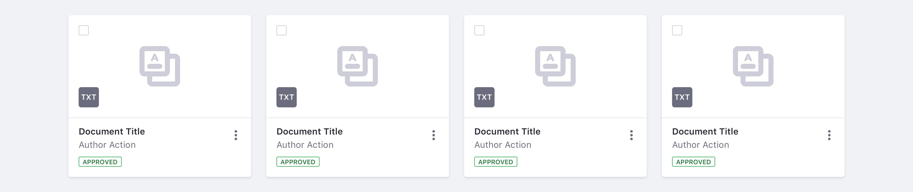

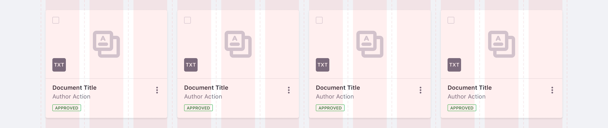

Lexicon's column system is based on Bootstrap's twelve column CSS Grid, with an adjustment to the gutter to fit our base grid. The gutter of Lexicon's column system is 24px, the same value that is used throughout other basic structural references of the system.

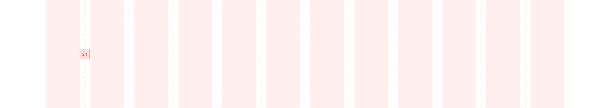

The columns are fluid, having a responsive width that conforms to the size of their parent container. The gutter's width, however, remains fixed when the viewport resizes.

### Vertical Rhythm

The 8px base grid is also used as a baseline to determine the vertical distance between elements. When determining the vertical distance between medium and large size structural blocks of elements, such as lengthy paragraphs, however, it is better to have a greater value as a baseline. This value borrows Bootstrap's variable name: "spacer-y". To keep a consistent vertical rhythm, we use the main system font style's line height, 24 px, as the reference for this value.

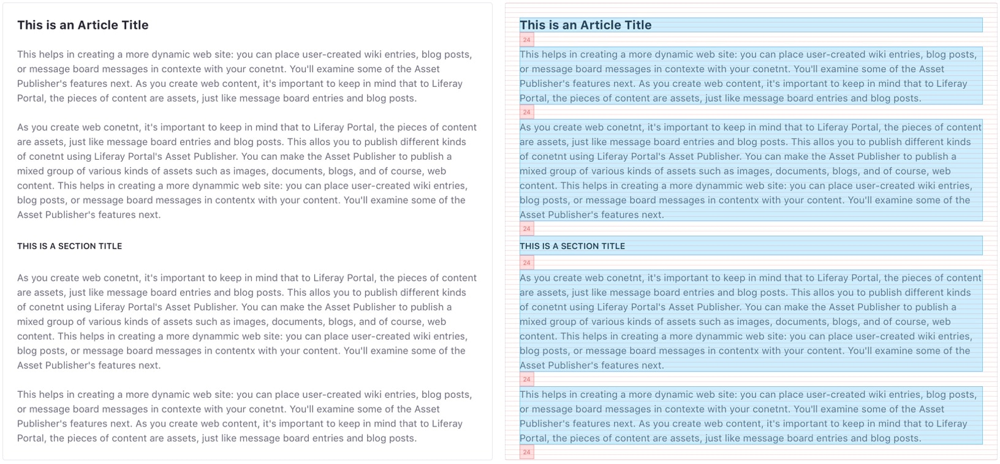

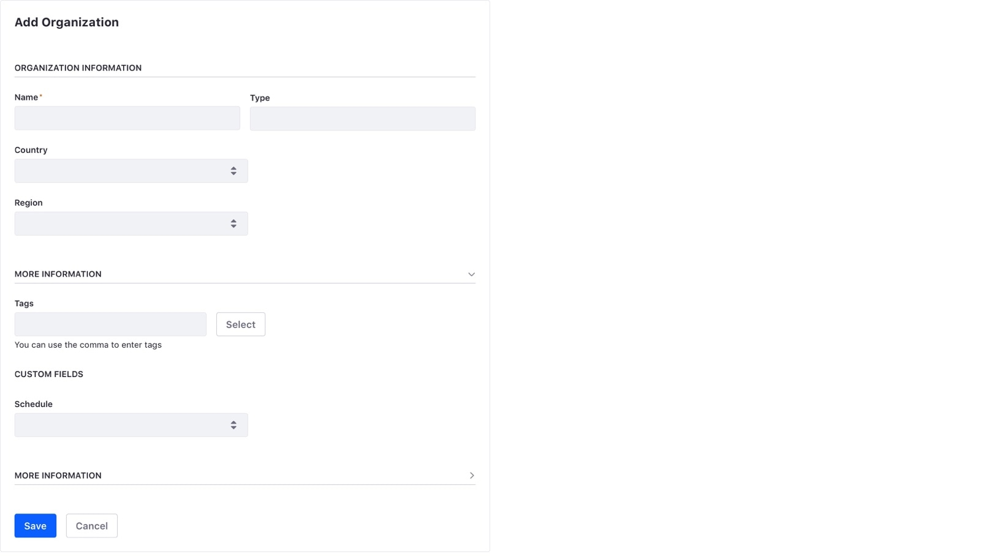

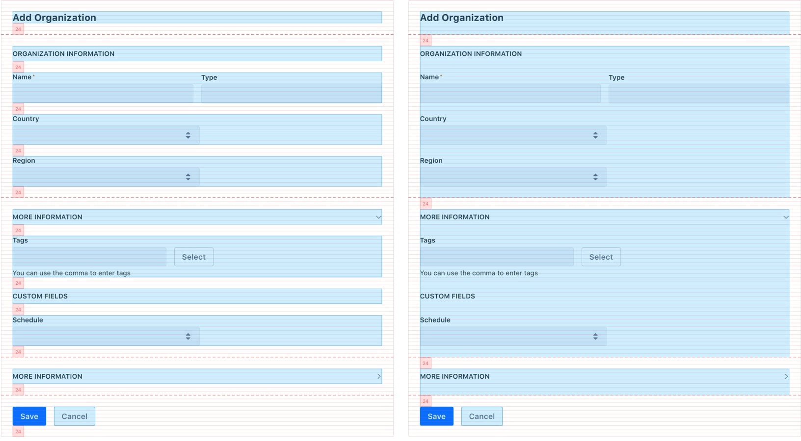

For small viewports, we can make adjustments to optimize vertical space, while still respecting the base grid. In these cases, we use the 16px spacer-y, as we do for the gutter between columns and the lateral space of the container.

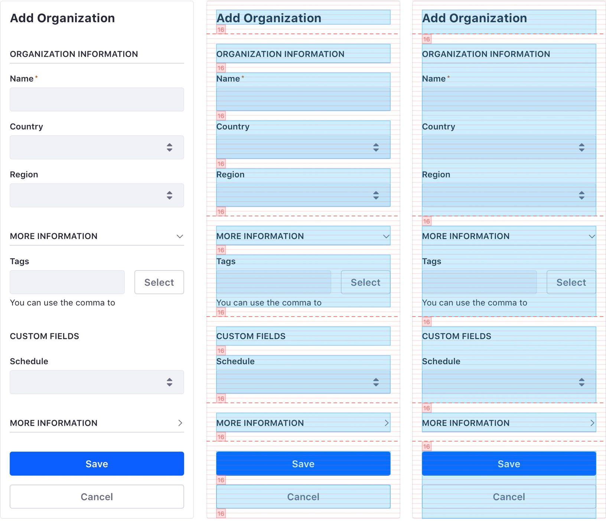

Although this metric may not cover all vertical space requirements, it serves as a starting point that you can adjust to meet your needs.

### Containers

Lexicon provides two types of containers: A fixed width container and a fluid container with relative width.

#### Fluid container

This container's width is responsive to the size of the viewport.

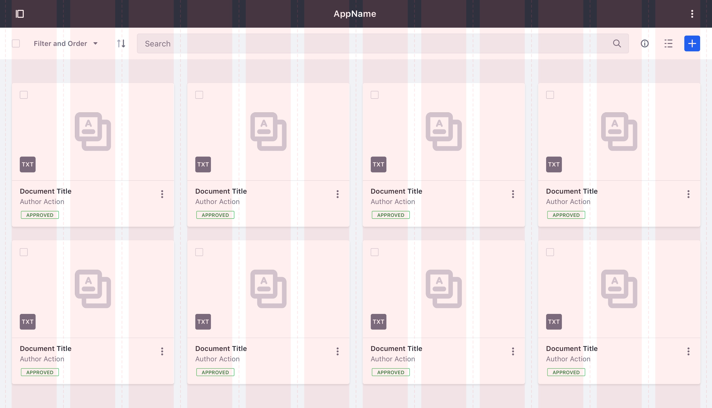

#### Fixed width container

This container defines a maximum width. This value adjusts to the viewport's size based on predefined breakpoints.

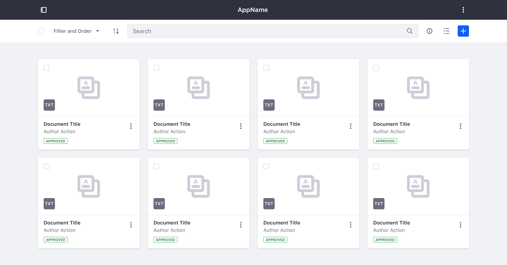

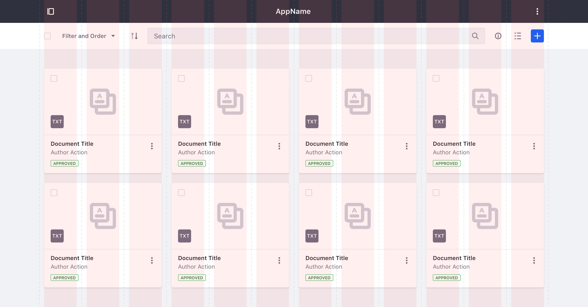

### Breakpoint table

The table below shows the layout system values for the different breakpoints:

| Breakpoint  | Device Size                           | Container Width |
| ----------- | ------------------------------------- | --------------- |
| < 576px     | Extra small devices (Portrait phones) | Auto            |
| &ge; 576px  | Small devices (Landscape phones)      | Auto            |
| &ge; 768px  | Medium devices (Tablets)              | Auto            |
| &ge; 992px  | Large devices (Desktops)              | Auto            |
| &ge; 1280px | Extra large devices (Large desktops)  | 1248px          |
